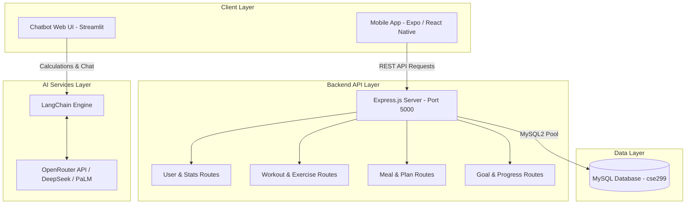

# 🏋️‍♂️ FitNut AI — Next-Gen Fitness & Nutrition System 🥗

[](https://opensource.org/licenses/ISC)
[](https://reactnative.dev/)
[](https://expo.dev/)
[](https://nodejs.org/)
[](https://www.mysql.com/)
[](https://www.python.org/)
[](https://www.langchain.com/)
[](https://muntasir-shawon.github.io/FitNut-Fitness-Nutrition-System/)

🌐 **Live Web Application**: [https://muntasir-shawon.github.io/FitNut-Fitness-Nutrition-System/](https://muntasir-shawon.github.io/FitNut-Fitness-Nutrition-System/)

**FitNut AI** is an end-to-end, intelligent fitness and nutrition management ecosystem designed to help users achieve their physical wellness goals. The system integrates a modern **cross-platform mobile app** (iOS/Android/Web), a robust **Node.js/Express & MySQL REST API**, and an advanced **LangChain & OpenRouter AI Chatbot** for tailored workout routines, meal plans, macro calculations, and progress tracking.

---

## 📑 Table of Contents

- [✨ Key Features](#-key-features)
- [🏛️ System Architecture](#️-system-architecture)
- [📂 Project Structure](#-project-structure)
- [🛠️ Tech Stack](#️-tech-stack)
- [🚀 Getting Started](#-getting-started)
  - [Prerequisites](#prerequisites)
  - [1. Backend Setup & Database Migration](#1-backend-setup--database-migration)
  - [2. Frontend (Mobile App) Setup](#2-frontend-mobile-app-setup)
  - [3. LLM Chatbot Setup](#3-llm-chatbot-setup)
- [📡 API Documentation](#-api-documentation)
- [🗄️ Database Schema](#️-database-schema)
- [🤖 AI Chatbot Capabilities](#-ai-chatbot-capabilities)
- [⚙️ How to Rename & Make Repository Public](#️-how-to-rename--make-repository-public)
- [🤝 Contributing](#-contributing)
- [📄 License](#-license)

---

## ✨ Key Features

### 📱 1. Mobile Application (Frontend)
- **Glassmorphic Dark UI**: Modern aesthetic built with Expo Blur, gradients, and custom typography (Space Grotesk & Inter).
- **Interactive Workout & Meal Plans**: Detailed exercise breakdown (sets, reps, rest timers) and macro-balanced recipes with step-by-step cooking instructions.
- **BMI & Health Metric Calculator**: Real-time BMI evaluation with visual scale categorization and tailored health advice.
- **Goal Setting & Tracking**: Category-based goal management (Weight Loss, Muscle Gain, Endurance) with deadline tracking and progress bars.
- **Visual Analytics**: Interactive data visualization using `react-native-chart-kit` for weight trajectory, strength progression, and cardio endurance.
- **User Authentication & Profile**: Secure login/signup system with personalized dashboard metrics and achievements.

### 🌐 2. REST API & Database (Backend)
- **Modular MVC Architecture**: Clean route separation for users, workouts, exercises, meals, meal plans, schedules, goals, achievements, and user statistics.
- **Optimized Relational Schema**: MySQL database with foreign key constraints, cascading rules, and connection pooling.
- **Postman Collection Included**: Complete API testing suite ready for immediate import (`NextGen_Fitness.postman_collection.json`).

### 🤖 3. Intelligent Fitness Assistant (LLM Chatbot)
- **Powered by LangChain & OpenRouter**: Utilizes deep learning language models for conversational fitness advice.
- **Automated Health Metrics**: BMR (Mifflin-St Jeor equation), TDEE (Total Daily Energy Expenditure), and Macronutrient breakdown.
- **Custom Workout Split Generator**: Generates customized Push/Pull/Legs, Upper/Lower, or Full Body splits based on user schedule.
- **Interactive Streamlit Web Dashboard**: Standalone diagnostic interface and chat UI with logging and session persistence.

---

## 🏛️ System Architecture



---

## 📂 Project Structure

```text
NextGen_cse299/
├── Backend/                                # Node.js & Express REST API
│   ├── config/
│   │   └── db.js                          # MySQL connection pool configuration
│   ├── routes/
│   │   ├── achievementRoutes.js           # Milestones & badges endpoints
│   │   ├── exerciseRoutes.js              # Workout exercise endpoints
│   │   ├── goalRoutes.js                  # User fitness goals endpoints
│   │   ├── mealPlanRoutes.js              # Nutrition plans endpoints
│   │   ├── mealRoutes.js                  # Individual meal endpoints
│   │   ├── progressRoutes.js              # Progress logs endpoints
│   │   ├── scheduleRoutes.js              # Workout calendar endpoints
│   │   ├── userRoutes.js                  # User profile & auth routes
│   │   ├── userStatsRoutes.js             # User aggregate stats routes
│   │   └── workoutRoutes.js               # Workout routines endpoints
│   ├── app.js                             # Express server entry point
│   ├── cse299.sql                         # MySQL database schema & sample data
│   ├── NextGen_Fitness.postman_collection.json # Postman API collection
│   ├── package.json
│   └── package-lock.json
│
├── Frontend/                               # Cross-Platform React Native App
│   ├── app/
│   │   ├── (auth)/                        # Authentication screens
│   │   │   ├── _layout.tsx
│   │   │   ├── login.tsx                  # Login screen
│   │   │   └── signup.tsx                 # Registration screen
│   │   ├── (tabs)/                        # Main navigation tabs
│   │   │   ├── _layout.tsx                # Bottom tab bar configuration
│   │   │   ├── index.tsx                  # Home dashboard
│   │   │   ├── plan.tsx                   # Workouts & meal plans
│   │   │   ├── bmi.tsx                    # BMI calculator
│   │   │   ├── goals.tsx                  # Goal tracking
│   │   │   ├── progress.tsx               # Analytics & charts
│   │   │   └── profile.tsx                # User profile & stats
│   │   ├── _layout.tsx                    # Root navigation layout
│   │   └── +not-found.tsx                 # 404 handler
│   ├── assets/images/                     # Icons & static assets
│   ├── hooks/                             # Custom React hooks
│   ├── app.json                           # Expo app manifest
│   ├── package.json
│   ├── tsconfig.json
│   └── package-lock.json
│
├── LLM-Chatbot/                            # AI Fitness Assistant
│   ├── app.py                             # Main Streamlit AI application
│   ├── streamlit_app.py                   # Alternative Streamlit frontend
│   ├── fitness_bot.py                     # LangChain PaLM / OpenRouter bot class
│   ├── openrouter_llm.py                  # OpenRouter custom LLM wrapper
│   ├── utils.py                           # BMR, TDEE, Macros, Workout split calculations
│   ├── debug_utils.py                     # Logging and telemetry decorators
│   ├── run_bot.py                         # CLI-based chatbot runner
│   ├── test_openrouter.py                 # API test script
│   ├── requirements.txt                   # Python dependencies
│   └── README.md                          # Subsystem documentation
│
└── README.md                               # Project documentation
```

---

## 🛠️ Tech Stack

| Domain | Technologies |
|---|---|
| **Mobile & Web UI** | React Native, Expo SDK 52, Expo Router v4, TypeScript, Lucide Icons, Expo Blur, React Native Chart Kit |
| **Backend & API** | Node.js, Express.js, MySQL2 (Promises & Connection Pooling), CORS, Dotenv |
| **Database** | MySQL / MariaDB (phpMyAdmin compatible dump provided) |
| **AI & LLM** | Python 3.10+, LangChain, OpenRouter API (DeepSeek Chat, Google PaLM), Streamlit, Pandas, NumPy |
| **Tooling & Testing**| Postman, Nodemon, Expo CLI, Git |

---

## 🚀 Getting Started

Follow the steps below to set up and run all three subsystems on your local machine.

### Prerequisites
- **Node.js** (v18 or newer) & **npm**
- **Python** (v3.10 or newer) & **pip**
- **MySQL Server** (via XAMPP, WampServer, or standalone MySQL Server)
- **Expo Go App** (on iOS/Android device) or an iOS Simulator / Android Emulator / Web Browser

---

### 1. Backend Setup & Database Migration

1. **Import Database Schema**:
   - Start your MySQL server (e.g. through XAMPP or MySQL CLI).
   - Create a database named `cse299`:
     ```sql
     CREATE DATABASE cse299;
     ```
   - Import the schema and seed data from `Backend/cse299.sql`:
     ```bash
     mysql -u root -p cse299 < Backend/cse299.sql
     ```
     *(Or import `Backend/cse299.sql` directly using phpMyAdmin).*

2. **Configure Environment Variables**:
   - Navigate to the `Backend/` directory:
     ```bash
     cd Backend
     ```
   - Create a `.env` file with the following variables:
     ```env
     PORT=5000
     DB_HOST=localhost
     DB_USER=root
     DB_PASS=your_mysql_password
     DB_NAME=cse299
     ```

3. **Install Dependencies & Start the Server**:
   ```bash
   npm install
   npm run dev
   ```
   > Server will start at `http://localhost:5000`.

---

### 2. Frontend (Mobile & Web App) Setup

1. **Navigate to the Frontend directory**:
   ```bash
   cd Frontend
   ```

2. **Install Dependencies**:
   ```bash
   npm install
   ```

3. **Run on Web & Mobile**:
   - **🌐 Web Browser**:
     ```bash
     npm run web
     ```
     *(Opens automatically in your default web browser at `http://localhost:8081`)*
   
   - **📱 Mobile (Expo Go on iOS / Android)**:
     ```bash
     npm start
     ```
     *(Scan the generated QR code using your phone camera on iOS or the Expo Go app on Android)*
   
   - **🤖 Android Emulator**:
     ```bash
     npm run android
     ```
   
   - **🍎 iOS Simulator** *(macOS only)*:
     ```bash
     npm run ios
     ```
   
   - **📦 Production Web Build**:
     ```bash
     npm run build:web
     ```
     *(Outputs static web bundle ready for hosting to `Frontend/dist/`)*

---

### 3. LLM Chatbot Setup

1. **Navigate to the Chatbot directory**:
   ```bash
   cd LLM-Chatbot
   ```

2. **Create and Activate a Virtual Environment** *(recommended)*:
   ```bash
   # Windows
   python -m venv venv
   .\venv\Scripts\activate

   # macOS / Linux
   python3 -m venv venv
   source venv/bin/activate
   ```

3. **Install Dependencies**:
   ```bash
   pip install -r requirements.txt
   ```

4. **Configure Environment Variables**:
   - Create a `.env` file in `LLM-Chatbot/`:
     ```env
     OPENROUTER_API_KEY=your_openrouter_api_key_here
     # Optional: For Google PaLM direct integration
     GOOGLE_API_KEY=your_google_api_key_here
     ```
   > Obtain your API key at [OpenRouter.ai](https://openrouter.ai/).

5. **Run the Application**:
   - **Streamlit Web UI**:
     ```bash
     streamlit run app.py
     ```
   - **Interactive CLI**:
     ```bash
     python run_bot.py
     ```

---

## 📡 API Documentation

Import the provided Postman collection located at `Backend/NextGen_Fitness.postman_collection.json` into Postman for ready-to-test endpoints.

### Key API Endpoints

| Resource | Method | Endpoint | Description |
|---|---|---|---|
| **Users** | `GET` | `/api/users` | Fetch all user profiles |
| | `GET` | `/api/users/:id` | Fetch specific user details |
| | `POST` | `/api/users` | Register a new user |
| | `PUT` | `/api/users/:id` | Update user details |
| | `DELETE` | `/api/users/:id` | Remove a user |
| **User Stats** | `GET` | `/api/user-stats/:userId` | Get user statistics & success rate |
| | `POST` | `/api/user-stats` | Record user stats |
| | `PUT` | `/api/user-stats/:id` | Update stats |
| **Workouts** | `GET` | `/api/workouts` | Retrieve all workout programs |
| | `GET` | `/api/workouts/:id` | Get workout details |
| | `POST` | `/api/workouts` | Create new workout routine |
| **Exercises** | `GET` | `/api/exercises/workout/:workoutId` | Fetch exercises for a specific workout |
| | `POST` | `/api/exercises` | Add new exercise |
| **Meal Plans** | `GET` | `/api/meal-plans` | List available nutrition plans |
| | `POST` | `/api/meal-plans` | Create a new meal plan |
| **Meals** | `GET` | `/api/meals/plan/:mealPlanId` | Fetch meals under a meal plan |
| | `POST` | `/api/meals` | Add a new meal with macro info |
| **Progress** | `GET` | `/api/progress/user/:userId` | Fetch user tracking history |
| | `POST` | `/api/progress` | Log daily weight and performance |
| **Goals** | `GET` | `/api/goals/user/:userId` | Retrieve user target goals |
| | `POST` | `/api/goals` | Set a new fitness goal |
| **Achievements** | `GET` | `/api/achievements/user/:userId` | List unlocked achievements |
| **Schedule** | `GET` | `/api/schedule/user/:userId` | Get user's workout schedule |
| | `PUT` | `/api/schedule/:id/status` | Update schedule completion status |

---

## 🗄️ Database Schema

The relational database consists of 10 structured tables:

```
 users (user_id, email, password_hash, first_name, last_name, bio, profile_image_url)
   ├── user_stats (stat_id, user_id, workout_count, achievement_count, success_rate)
   ├── user_goals (goal_id, user_id, goal_type, target_value, start_date, target_date, status)
   ├── achievements (achievement_id, user_id, name, description, milestone_value, date_achieved)
   ├── progress_tracking (progress_id, user_id, date, weight, strength_level, cardio_performance, notes)
   └── training_schedule (schedule_id, user_id, workout_id, scheduled_date, completion_status)

 workouts (workout_id, name, description, difficulty_level, duration_minutes, calorie_burn)
   └── exercises (exercise_id, workout_id, name, description, sets, reps, rest_period_seconds, tips)

 meal_plans (meal_plan_id, name, description, total_calories, protein_grams, carbs_grams, fats_grams)
   └── meals (meal_id, meal_plan_id, name, ingredients, cooking_instructions, calories, protein, carbs, fats)
```

---

## 🤖 AI Chatbot Capabilities

The AI assistant provides real-time fitness guidance:
- **Caloric & Macro Computation**: Automatically calculates maintenance calories and macro splits (Protein / Carbohydrates / Fats) according to goals:
  - *Fat Loss / Cutting*: High protein, moderate calorie deficit
  - *Muscle Gain / Bulking*: Hypertrophy-focused caloric surplus
  - *Maintenance*: Balanced energy intake
- **Dynamic Workout Splits**: Recommends optimized training splits based on weekly frequency (3-day full body, 4-day upper/lower, 6-day PPL).
- **Persistent Conversation**: Retains context within the session using LangChain's `ConversationBufferMemory`.

---

## ⚙️ How to Rename & Make Repository Public

If you wish to rename this repository (for instance, to `FitNut-AI`) and make it public on GitHub, follow these quick steps:

### Option A: Via GitHub Web Interface
1. Go to your repository on GitHub: [github.com/Muntasir-Shawon/NextGen_cse299](https://github.com/Muntasir-Shawon/NextGen_cse299).
2. Click on the **⚙️ Settings** tab.
3. **To Rename:**
   - In the **General** settings under **Repository name**, enter your desired name (e.g., `FitNut-AI` or `FitNut-Fitness-Nutrition-System`).
   - Click **Rename**.
4. **To Make Public:**
   - Scroll down to the bottom to the **Danger Zone** section.
   - Click **Change visibility** next to "Change repository visibility".
   - Select **Make public**, follow the confirmation prompt, and confirm.

### Option B: Via GitHub CLI (`gh`)
If you have the GitHub CLI installed and authenticated:
```bash
# Rename the repository
gh repo rename FitNut-AI

# Change visibility to Public
gh repo edit --visibility public
```

### Updating Local Git Remote (if renamed)
If you rename the repository on GitHub, update your local remote URL:
```bash
git remote set-url origin https://github.com/Muntasir-Shawon/FitNut-AI.git
```

---

## 🤝 Contributing

Contributions, issues, and feature requests are welcome!
1. Fork the Project
2. Create your Feature Branch (`git checkout -b feature/AmazingFeature`)
3. Commit your Changes (`git commit -m 'Add some AmazingFeature'`)
4. Push to the Branch (`git push origin feature/AmazingFeature`)
5. Open a Pull Request

---

## 📄 License

Distributed under the **ISC License**. See `Backend/package.json` for details.